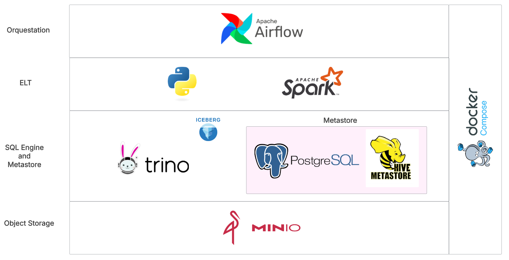
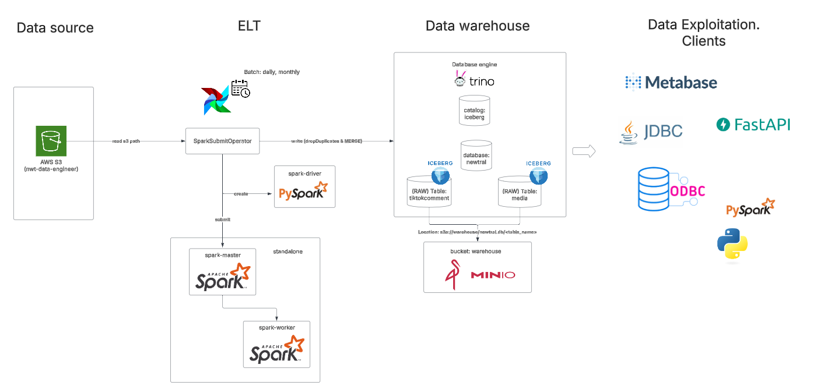
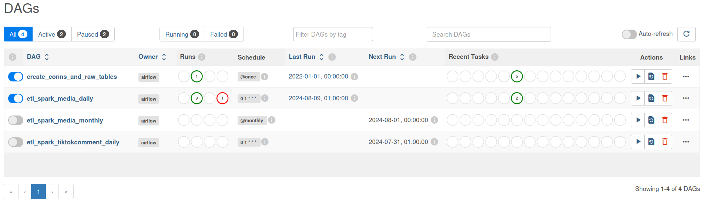
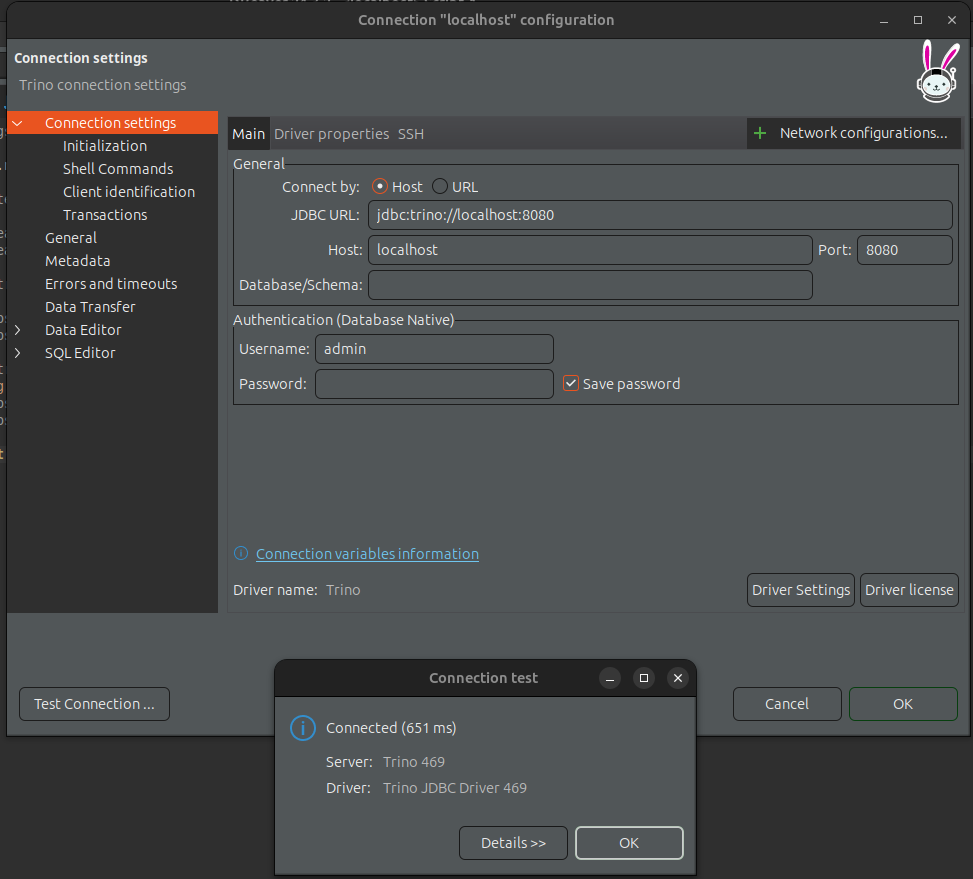
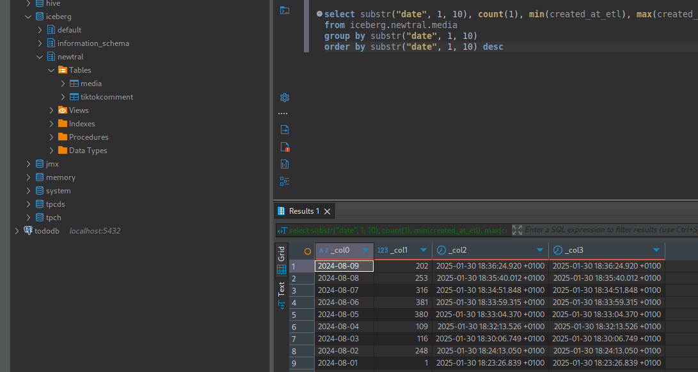

# newtral_takehome

Este repositorio contiene un framework basado en Modern Data Stack para ingestar y almacenar datos. El objetivo de este proyecto es disponibilizar una demo funcional, pero construida sobre aplicaciones capaces de escalar horizontalmente y, por tanto, aptas para llevarlas a un entorno productivo para manejar grandes volúmenes de datos. 

Cada apliación del framework está compuesta por uno o varios contenedores `docker`. El despliegue se realiza mediante `docker-compose`.

La arquitectura de componentes es la siguiente:

De forma general, la elección de los componentes se ha realizado primando la escalabilidad de los componentes, ya que en los requisitos se menciona que la solución debe soportar la ingesta diaría de un gran volumen de datos. A continuación expongo una pequeña justificación de la elección de los componentes pricipales:
- MINIO: (i) permite contruir un datawarehose (en este caso) simulando el comportamiento de `AWS S3` y (ii) permite desacoplar el cómputo del almacenamiento en el motor analítico (`trino`)
- Trino: motor OLAP SQL escalable, eficiente, con gran conectividad, muy usado en la comunidad y base de `AWS Athena`, con conectividad con `Apache Spark` e integración con `Apache Iceberg`.
- Iceberg: formato de tablas OLAP altamente escalable con soporte ACID y CRUD. Permite la realización de inserciones tipo UPSERT, lo que satiface parte de los requisitos solicitados. Se ha elegido `Iceberg`sobre `Hudi`y `Delta` por ser un formato con el que he trabajado previamente.
- Spark: al contrario que Pandas, que aloja todos los datos en memoria, (Py)Spark permite realizar ingestas/transformaciones de grandes volúmenes gracias a su escalado horizontal. Tiene una enorme contectividad con sistemas de almacenamiento y motores analíticos. Para la ingesta de datos desde `AWS S3` a tablas `Iceberg` en `Trino` es ideal por su escalabilidad, además de por su funcionalidad (lectura de json, inferencia del `data-schema`, eliminación de duplicados).
- `Airflow`: orquestador que nos proporciona trazabilidad y observabilidad de los procesos ELT (entre otras muchas características). He elegido Airflow por haberlo utilizado anteriormente.
- Despliegue de componentes: he elegido `docker compose` por conocerlo y proporcionar el aislamiento necesario.

**Observación**: hay que tener en cuenta que, el volumen de datos del bucket `nwt-data-engineer` usado para este test es pequeño, lo que no justificaría el uso de Spark, Trino (se podría usar Python con Pandas, y un almacen tipo DuckDB). He tomado como requisito básico la escalabilidad.

Para el desarrollo del framework, se ha realizado una búsqueda entre distintos repositorios disponibles en la comunidad, con el fin de tener una base sobre la que desarrollar y ahorrar tiempo. Finalmente, se ha tomado como base el repositorio [**lasagna**](https://github.com/gmrqs/lasagna), el cual ha proporcionado el código base y sin el cual no podría haber llevado a cabo este proyecto en tiempo.
Sobre este repositorio se han hecho grandes modificaciones y adiciones en los servicios, como son:
- Añadir servicio Airflow, creación del Dockerfile completo,  configuración de volúmenes, configuración de librerías de Spark para poder ejecutar jobs sobre el cluster standalone, etc
- Modificar Dockerfile de Spark
- Eliminar servicio no necesario del docker-compose

El framework contiene el código necesario para inicializar las aplicaciones y desplegar las ETLs. Por nombrar algunos procesos que he automatizado en tiempo de despliegue:
- Se crea el bucket `warehouse` en MinIO para el almacenamiento de las tablas de Trino. Se crea con el servicio `createbucket` del docker-compose.
- Se crea el schema `newtral` y las tablas Iceberg `media` y `tiktokcomment` en Trino.
- Se configuran en `Airflow` conexiones a Spark y Trino

## Arquitectura del dato&procesos

Limitaciones:
- Por limitaciones de tiempo, se han creado las ETL y tablas para los sources `media`y `tiktokcomment`
- Solo se han creado las ETL y tablas para los sources `media`y `tiktokcomment`
- La capa `Data Exploitation. Clients`, no está implementada, pero si está disponible el acceso a las tablas de Trino (ver apartado "Consulta de datos del data warehouse")
## Código ETL

Como se ha comentado anteriormente, la ETL se ha desarrollado en PySpark: [Link al script Ptyhon](./mount/airflow/scripts/etl_job.py).

Todo el código se encuentra comentado para su entendimiento.
Si cabe mencionar que, para evitar la aparición de duplicados en las tablas raw de trino (media, etc), se ha tomado como clave primaria el campo `id` que proviene en el dato entrante. El control de duplicados se realiza en dos pasos:
- 1º eliminar posibles duplicados dentro de los datos entrantes leídos desde S3 (batch)
- 2º a la hora de insertar los datos entrates en la tabla destino (trino), solo se insertan aquellas filas cuyo `id` aún no existe en dicha tabla

Por otro lado, y con el fin de ayudar con el linaje del dato, al dato entrante se le han añadido las siguientes columnas:
- `created_at_etl`: `timestamp` de cuando la ETL proceso la fila (todo el batch comparte el mismo timestamp)
- `source_file_name`: path original del fichero json en el bucket de AWS S3

## DAGs de Airflow

Se han desarrollado los siguientes DAGs:

- `etl_spark_media_daily`: DAG para ingesta **diaria** de datos desde source AWS S3 `Media` a la tabla `iceberg.newtral.media`. Para la ingesta se usa el operador `SparkSubmitOperator`. Se ha configurado la ingesta a las 1AM UTC+0, para asegurar que se lanza la ingesta a día cerrado. Si se desea, el intervalo del batch se puede pasar de diario a minutos (ej: cada 15 minutos). Como se ha explicado en el código de la ETL, no se generarán duplicados en la tabla. Para eficientar una posible ingesta inferior a 24h (ej, cada 30 minutos), habría que cambiar el particionado del bucket source `nwt-data-engineer` o configurar una cola tipo AWS SQS para así ingestar solo los nuevos ficheros desde el último batch (delta). Observación: La primera ejecución de este DAG (día de datos 2024-07-31) dará error ya que no existen datos en el bucket para dicho día. Se ha configurado así el DAG a propósito para que se observe un error en la ETL.
- `etl_spark_media_monthly`: DAG para ingesta **mensual** de datos desde source AWS S3 `Media` a la tabla `iceberg.newtral.media`. Este DAG tiene sentido si se desea ingestar un histórico de datos de varios meses o años hacia atrás. La ejecución es lenta debido a las limitaciones del cluster Spark configurado (en un entorno productivo con recursos suficientes ejecutará sin problemas).
- `etl_spark_tiktokcomment_daily`: igual que el DAG `etl_spark_media_daily` pero para el source `TiktokComment` y la tabla `iceberg.newtral.tiktokcomment`.
- `create_conns_and_raw_tables`: este DAG realiza algunas tareas iniciales, y está configurado para lanzarse automáticamente cuando se crea el container de Airflow, y no es necesario lanzarlo manualmente. Este DAG crea:
  - Usuario para entrar en la WEB UI de Airflow (ver más abajo)
  - Conexiones de Airflow a Spark y Trino
  - Schemas y tablas en Trino

**Activación de las ETLs**:
- Se han configurado los DAGs de las ETLs para que se desplieguen en pause (no se ejecutan). Para activar una ETL e ingestar datos en la tabla, entrar en la WEB UI de Airflow (ver más abajo) y activar el DAG.
- Intervalo de datos de ingesta: los DAGs tienen configurado un pequeño intervalo de días de ingesta por la limitación del despliegue realizado de Airflow (ver siguiente punto). El DAG mensual tiene 2 meses.

**Limitaciones**: el Docker configurado usa la mínima instalación de Airflow, lo que incluye SQLite para el registro de sus eventos. Por ello Airflow solo puede ejecutar **una tarea a la vez** (`SequentialExecutor`). Esto provoca que los DAGs, y por tanto las ETLs, se ejecuten secuencialmente (ingestar 1 día de datos de un source tarda entre 1 y 2 minutos). En un entorno productivo, Airflow podrá ejecutar tantas ETLs de forma paralela como le indiquemos en la configuración del DAG.

## Levantar framework

Ejecutar el comando `docker compose up -d`.

Una vez todos los container estén levantados, se podrán acceder a las url de los servicios:

- Airflow:
    - http://localhost:8081
    - user: airflow
    - password: airflow
    - Este container tarda un poco en iniciarse completamente, por lo que la web puede tardar un poco en estar levantada
    - Como se ha comentado más arriba, activar alguna ETL (se recomienda diaria), para ingestar datos

- Spark:
    - Master: http://localhost:5050/
    - Worker: http://localhost:5051/
    - Driver Airflow (cuando haya un Job Spark ejecutando): http://localhost:4050

- Minio:
    - http://localhost:9090
    - user: admin
    - password: password

-  Trino:
    - http://localhost:8080/
    - user: admin
    - password: no es necesaria

## Consulta de datos del data warehouse

Para la consulta de datos de trino, basta con instalarse cualquier cliente jdbc. Aquí se muestra un ejemplo con DBeaver

Ejemplo de consulta:

## Advertencia de seguridad
Este framework está realizado para propósitos de demo, donde se ha primado la funcionalidad y el rápido prototipado (las contraseñas de acceso a los servicios están expuestas y no securizadas).

